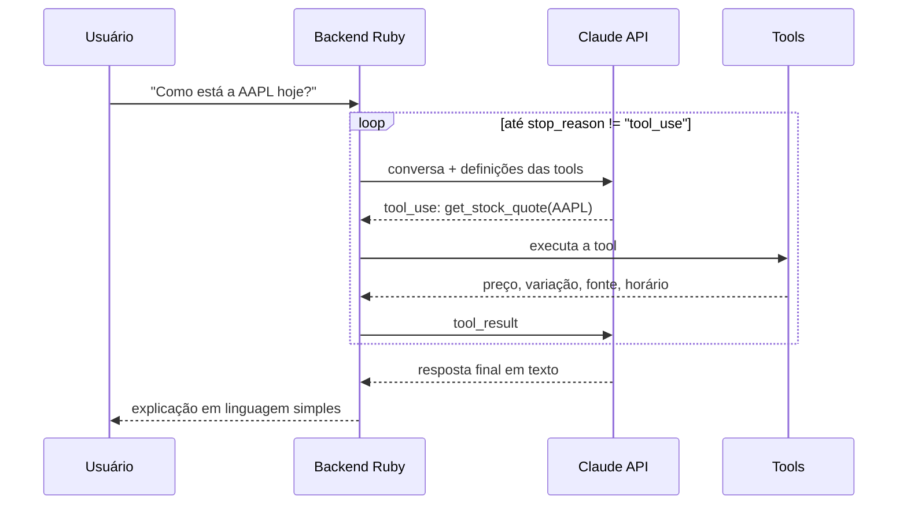

# MarketPulse AI


**Um assistente que usa IA para explicar o mercado, e não para adivinhá-lo.**

O MarketPulse é um chat que traduz cotações e indicadores do mercado financeiro para investidores iniciantes. O usuário pergunta em linguagem natural. Um agente baseado no Claude decide quais dados buscar, o código Ruby busca e calcula, e o Claude explica o resultado em linguagem simples.

> ⚠️ Projeto educacional. Nada aqui é recomendação de investimento.

## Status

🚧 **Marco 0: fundação.** O loop do agente roda no terminal com uma tool (`get_stock_quote`) e dados simulados. Veja o [roadmap](#roadmap).

## Como funciona

O núcleo é um loop de agente no padrão ReAct. O Claude não recebe os dados prontos: ele **pede** o que precisa, por meio de tools, até ter o suficiente para responder.



**Princípio central:** o código calcula, o Claude interpreta. Todo número exibido vem de uma tool determinística, com fonte e horário.

## Começando

Você precisa de uma chave da API da Anthropic.

### Com Docker (recomendado)

```bash
cp .env.example .env              # cole sua chave no .env
docker compose build
docker compose run --rm chat
```

### Direto no Ruby (3.3+)

```bash
export ANTHROPIC_API_KEY="sua-chave"
ruby bin/chat
```

Experimente perguntar: *"Como está a AAPL hoje?"* ou *"Compare MSFT e PETR4"*. O terminal mostra cada turno do loop e cada tool chamada.

## Testes

```bash
rake test                                   # local
docker compose run --rm chat rake test      # no container
```

Os testes usam um Claude simulado (`ScriptedClaude`), então rodam sem chave e sem custo.

## Estrutura

```
bin/chat                      # REPL no terminal
lib/agent.rb                  # o loop do agente
lib/claude_client.rb          # cliente HTTP da API (stdlib)
lib/tools/registry.rb         # registro de tools por duck typing
lib/tools/stock_quote_tool.rb # primeira tool
lib/fake_market_client.rb     # dados simulados
test/                         # Minitest
docs/adr/                     # decisões de arquitetura
```

## Decisões de arquitetura

- [ADR-001: Stack e princípios](docs/adr/001-stack-e-principios.md)
- [ADR-002: Duck typing para o registro de tools](docs/adr/002-duck-typing-para-registro-de-tools.md)

## Roadmap

- [x] **Marco 0: fundação.** Loop do agente, testes, Docker, CI e ADRs.
- [ ] **Marco 1: contrato de tools.** `search_ticker` e o teste de contrato `ToolContract`.
- [ ] **Marco 2: dados reais.** API financeira, `get_price_history` e PostgreSQL no Compose.
- [ ] **Marco 3: web.** Sinatra, chat em vanilla JS e streaming de respostas.
- [ ] **Marco 4: indicadores.** `get_fundamentals` e interface com progressive disclosure.
- [ ] **Marco 5: previsão com rigor.** Baselines, backtest walk-forward e placar de acertos.
- [ ] **Marco 6: expansão.** Microserviço Python, notícias e análise de sentimento.

## Autor

**Pedro Barbosa**, UX Engineer & Designer · [LinkedIn](https://linkedin.com/in/pedrogalva)
